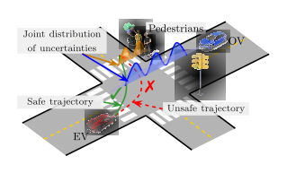

# Intention-Aware Control Facilitated by Polynomial Chaos Expansion

**Author:** ***Zengjie Zhang*** (z.zhang3@tue.nl)

A benchmark of intention-aware control of autonomous vehicles using polynomial chaos expansion (PCE).

## Release

It is suggested to download the `release` branch or the releases for a cleaned up version.

## Introduction

When an autonomous vehicle interacts with other traffic participants, the awareness of the intentions of these participants strongly impacts the safety and reliability of its decision-making. **Fig. 1** shows an intersection case where an ego vehicle (EV) plans a left turn while avoiding collisions with opponent vehicles (OVs) and pedestrians from the opposite direction. Understanding the intentions of these participants (e.g., moving fast or slowly) facilitates the design of a safe and flexible policy. 



**Figure 1. An intersection scenario.**

## Approach

This project provides a correct-by-design solution for intention-aware control of uncertain autonomous agents. By formulating unknown intentions of traffic participants as discrete-valued random variables, we derive a stochastic control problem for epistemically uncertain agents with a belief-space specification. In this way, the risk is quantified as the probability of not satisfying certain belief-space specifications, and the control problem is aimed to restrict the risk with a predefined threshold. Then, we use stochastic expansion to convert this challenging stochastic control problem into a tractable deterministic control problem with an STL specification. This allows us to solve a challenging intention-aware control problem using off-the-shelf tools, such as shrinking-horizon MPC based on Mixed-Integer Planning (MIP). With assumed intention models, the solved intention-aware controller allows automatic policy adjustment and ensures strict risk limitation. 

**Fig. 2** shows the comparison between a conventional no-aware controller and the proposed intent-aware controller. The blue blocks are sampled OVs subject to a multi-modal distribution, corresponding to ***speeding up***, ***constant speed***, and ***slow down*** intents. The results clearly show that the EV with a no-aware controller may collide with a ***speeding up*** OV, while the intent-aware vehicle can effectively avoid collision with all possible OVs.


**Figure 2. The comparison between no-aware (left) and intent-aware (right) controllers.**


## Installation

### Requirements

**Operating system**
 - *Windows* (compatible in general, succeed on 11)
 - *Linux* (compatible in general, succeed on 20.04)
 - *MacOS* (compatible in general, succeed on 13.4.1)

 **Python Environment**

 - Python `3.11`
 - Required Packages: `numpy`, `numpoly`, `scipy`, `treelib`, `matplotlib`, `importlib-metadata`. 

**Required Libraries**
 - `gurobipy` solver (**license** required, see [How to Get a Gurobi License](https://www.gurobi.com/solutions/licensing/))
 - `stlpy` toolbox (see [Documentation](https://stlpy.readthedocs.io/en/latest/) or [GitHub repository](https://github.com/vincekurtz/stlpy))
 - `chaospy` toolbox (see [Documentation](https://chaospy.readthedocs.io/en/master/) or [GitHub repository](https://github.com/jonathf/chaospy))

### Quick Installation
 
1. Install conda following this [instruction](https://conda.io/projects/conda/en/latest/user-guide/install/index.html);

2. Open the conda shell, and create an independent project environment;
```
conda create --name intentaware python=3.11
```

3. In the same shell, activate the created environment
```
conda activate intentaware
```

4. In the same shell, within the `intentaware` environment, install the dependencies one by one
 ```
conda install -c anaconda numpy
conda install -c conda-forge numpoly
conda install -c anaconda scipy
conda install -c conda-forge treelib
conda install -c conda-forge matplotlib
conda install -c conda-forge importlib_metadata
```

5. In the same shell, within the `intentaware` environment, install the libraries `gurobipy`, `stlpy`, and `chaospy`:
```
python -m pip install gurobipy
pip install stlpy
pip install chaospy
```

6. Last but not least, activate the `gurobi` license (See [How To](https://www.gurobi.com/documentation/current/remoteservices/licensing.html)). Note that this project is compatible with `gurobi` Released version `11.0.1`. Keep your `gurobi` updated in case of incompatibility. 

### Quick Run

- Lead to the `example` directory;
- Lead to the `overtaking` or the `intersection` folder;
- Run the main script `main.py`;
- Rendering constraints may take up to 1 to 2 minutes, depending on the computational performance;
- Plotted figures automatically saved in the `data` subfolder.

### Special visualization functions

If using `config/record` function, be sure to install `ffmpeg` first and make sure its installation folder shows up in the `PATH` environmental variable.

## License

This project is with a BSD-3 license, refer to `LICENSE` for details.